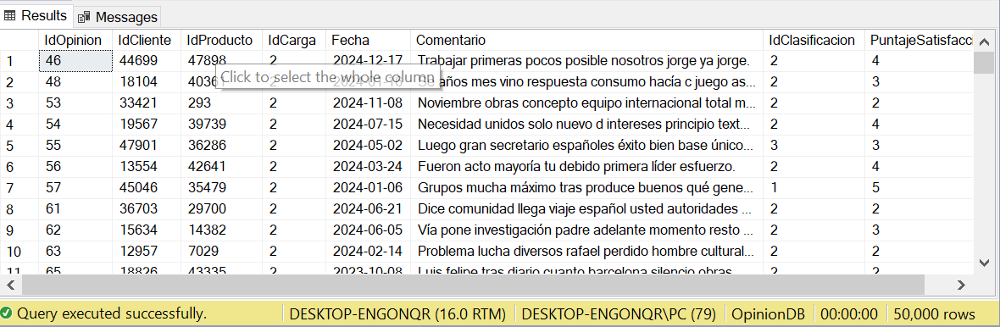

# Proyecto de Análisis de Opiniones de Clientes

Este proyecto implementa un proceso de ETL (Extracción, Transformación y Carga) para consolidar opiniones de clientes desde diversas fuentes en una base de datos relacional centralizada en **SQL Server**.

## Descripción General del Flujo

El proceso completo se gestiona a través de un script de Python (`main.py`) que realiza las siguientes operaciones:

1. **Extracción**: Lee datos de múltiples archivos CSV ubicados en la carpeta `/csv`, que contienen información sobre clientes, productos, comentarios de redes sociales, encuestas y reseñas web.  
2. **Transformación**:  
   * Limpia y estandariza los datos, incluyendo la normalización de IDs.  
   * Mapea datos categóricos (como categorías de productos, clasificaciones de encuestas) a sus correspondientes IDs en las tablas de dimensión.  
   * Asegura la integridad referencial creando registros "placeholder" para clientes o productos que se mencionan en las opiniones pero no existen en los archivos maestros.  
3. **Carga**: Inserta los datos limpios y transformados en la base de datos `OpinionDB` de SQL Server, poblando tanto las tablas de dimensiones como las tablas de hechos.

---

## Estructura de la Base de Datos

El diseño de la base de datos está orientado a soportar análisis de opiniones de manera estructurada y eficiente. Se incluyen **tablas de dimensiones** (clientes, productos, categorías, fuentes, clasificaciones) y **tablas de hechos** (comentarios, encuestas, reseñas web).  

### Descripción de Tablas

- **Clientes**: Contiene la información básica de los clientes, incluyendo nombre y correo electrónico.  
- **Categorias**: Clasifica los productos en diferentes categorías (ejemplo: electrónicos, ropa, alimentos).  
- **Productos**: Lista de productos ofrecidos, vinculados a una categoría.  
- **Clasificaciones**: Define las posibles clasificaciones de encuestas (ejemplo: “Positiva”, “Negativa”, “Neutral”).  
- **RegistroCargas**: Almacena el histórico de cargas de datos indicando nombre y fecha de cada proceso ETL.  
- **Fuentes**: Representa las diferentes plataformas de origen de las opiniones (ejemplo: “Twitter”, “Instagram”, “Facebook”, “Sitio Web”).  
- **Comentarios**: Registra los comentarios en redes sociales vinculados a un cliente, producto y fuente, con fecha y texto de opinión.  
- **Encuestas**: Guarda resultados de encuestas de satisfacción, con clasificación y puntaje (1 a 5).  
- **WebReviews**: Contiene reseñas web asociadas a un cliente y producto, junto con un **rating** de 1 a 5 estrellas.  

### Particiones de la Base de Datos

Para mejorar el rendimiento en consultas históricas, las tablas de hechos (Comentarios, Encuestas, WebReviews) están particionadas por rango de **fecha**, utilizando los siguientes grupos de archivos:  

- **FG_2024** → Datos con fecha hasta el **31-12-2024**.  
- **FG_2025** → Datos con fecha hasta el **31-12-2025**.  
- **FG_2026** → Datos posteriores al 01-01-2026.  

Esto permite escalar el almacenamiento y mejorar el rendimiento de consultas sobre grandes volúmenes de datos.

### Diagrama Entidad-Relación

La siguiente imagen muestra la relación entre las tablas:  


---

## Script SQL de Creación

El archivo `Base de Datos Relacional copy.sql` contiene todas las sentencias necesarias para crear la base de datos `OpinionDB`, las tablas, relaciones y esquemas de partición.  

> **Importante**: Modifica las rutas `FILENAME` para que apunten a directorios válidos en tu sistema.

```sql
CREATE DATABASE OpinionDB
ON PRIMARY
(
    NAME = N'OpinionDB_Primary',
    FILENAME = 'C:\RUTA_PERSONALIZADA\SQLData\OpinionDB_Primary.mdf',
    SIZE = 10MB,
    MAXSIZE = UNLIMITED,
    FILEGROWTH = 5MB
),
FILEGROUP FG_2024
(
    NAME = 'OpinionDB_2024',
    FILENAME = 'C:\RUTA_PERSONALIZADA\SQLData\Opinion2024\OpinionDB_2024.ndf',
    SIZE = 10MB,
    MAXSIZE = UNLIMITED,
    FILEGROWTH = 5MB
),
FILEGROUP FG_2025
(
    NAME = 'OpinionDB_2025',
    FILENAME = 'C:\RUTA_PERSONALIZADA\SQLData\Opinion2025\OpinionDB_2025.ndf',
    SIZE = 10MB,
    MAXSIZE = UNLIMITED,
    FILEGROWTH = 5MB
),
FILEGROUP FG_2026
(
    NAME = 'OpinionDB_2026',
    FILENAME = 'C:\RUTA_PERSONALIZADA\SQLData\Opinion2026\OpinionDB_2026.ndf',
    SIZE = 10MB,
    MAXSIZE = UNLIMITED,
    FILEGROWTH = 5MB
)
LOG ON
(
    NAME = N'OpinionDB_Log',
    FILENAME = 'C:\RUTA_PERSONALIZADA\SQLData\Logs\OpinionDB.ldf',
    SIZE = 10MB,
    MAXSIZE = 2GB,
    FILEGROWTH = 5MB
);
 
USE OpinionDB;
GO

CREATE TABLE Clientes (
    IdCliente INT PRIMARY KEY,
    Nombre NVARCHAR(100) NOT NULL,
    Email NVARCHAR(150) UNIQUE NOT NULL
);

CREATE TABLE Categorias (
    IdCategoria INT PRIMARY KEY IDENTITY(1,1),
    Nombre NVARCHAR(100) UNIQUE NOT NULL
);

CREATE TABLE Productos (
    IdProducto INT PRIMARY KEY,
    Nombre NVARCHAR(100) NOT NULL,
    IdCategoria INT,
    CONSTRAINT FK_Productos_Categoria FOREIGN KEY (IdCategoria) REFERENCES Categorias(IdCategoria)
);

CREATE TABLE Clasificaciones (
    IdClasificacion INT PRIMARY KEY IDENTITY(1,1),
    Nombre NVARCHAR(50) UNIQUE NOT NULL
);
GO

CREATE TABLE RegistroCargas (
    IdCarga INT PRIMARY KEY IDENTITY(1,1),
    Nombre NVARCHAR(50) UNIQUE NOT NULL,
    FechaCarga DATETIME NOT NULL
);

CREATE TABLE Fuentes (
    IdFuente INT PRIMARY KEY IDENTITY(1,1),
    Nombre NVARCHAR(100) UNIQUE NOT NULL -- Ej: 'Instagram', 'Twitter', 'Facebook'
);
GO

CREATE PARTITION FUNCTION pf_FechaRango (DATE)
AS RANGE LEFT FOR VALUES ('2024-12-31', '2025-12-31');
GO

CREATE PARTITION SCHEME ps_FechaRango
AS PARTITION pf_FechaRango
TO (FG_2024, FG_2025, FG_2026);
GO

CREATE TABLE Comentarios (
    IdComment VARCHAR(10) NOT NULL,
    IdCliente INT NOT NULL,
    IdProducto INT NOT NULL,
    IdFuente INT NOT NULL,
    Fecha DATE NOT NULL,
    Comentario NVARCHAR(MAX),
    PRIMARY KEY NONCLUSTERED (IdComment, Fecha),
    CONSTRAINT FK_Comentarios_Cliente FOREIGN KEY (IdCliente) REFERENCES Clientes(IdCliente),
    CONSTRAINT FK_Comentarios_Producto FOREIGN KEY (IdProducto) REFERENCES Productos(IdProducto),
    CONSTRAINT FK_Comentarios_Fuente FOREIGN KEY (IdFuente) REFERENCES Fuentes(IdFuente)
)
ON ps_FechaRango(Fecha);
GO

CREATE TABLE Encuestas (
    IdOpinion INT NOT NULL,
    IdCliente INT NOT NULL,
    IdProducto INT NOT NULL,
    IdCarga INT NOT NULL,
    Fecha DATE NOT NULL,
    Comentario NVARCHAR(MAX),
    IdClasificacion INT,
    PuntajeSatisfaccion INT CHECK (PuntajeSatisfaccion BETWEEN 1 AND 5),
    PRIMARY KEY NONCLUSTERED (IdOpinion, Fecha),
    CONSTRAINT FK_Encuestas_Clasificacion FOREIGN KEY (IdClasificacion) REFERENCES Clasificaciones(IdClasificacion),
    CONSTRAINT FK_Encuestas_Cliente FOREIGN KEY (IdCliente) REFERENCES Clientes(IdCliente),
    CONSTRAINT FK_Encuestas_Producto FOREIGN KEY (IdProducto) REFERENCES Productos(IdProducto),
    CONSTRAINT FK_Encuestas_Carga FOREIGN KEY (IdCarga) REFERENCES RegistroCargas(IdCarga)
)
ON ps_FechaRango(Fecha);
GO

CREATE TABLE WebReviews (
    IdReview VARCHAR(10) NOT NULL,
    IdCliente INT NOT NULL,
    IdProducto INT NOT NULL,
    IdCarga INT NOT NULL,
    Fecha DATE NOT NULL,
    Comentario NVARCHAR(MAX),
    Rating INT CHECK (Rating BETWEEN 1 AND 5),
    PRIMARY KEY NONCLUSTERED (IdReview, Fecha),
    CONSTRAINT FK_WebReviews_Cliente FOREIGN KEY (IdCliente) REFERENCES Clientes(IdCliente),
    CONSTRAINT FK_WebReviews_Producto FOREIGN KEY (IdProducto) REFERENCES Productos(IdProducto),
    CONSTRAINT FK_WebReviews_Carga FOREIGN KEY (IdCarga) REFERENCES RegistroCargas(IdCarga)
)
ON ps_FechaRango(Fecha);
GO
```

## Result set del select de cada tabla cargada
**Encuesta:**


**Encuesta:**


**Categoria:**


**Registro Cargas:**


**Registro Calificaicion:**


**Registro Producto:**


**Registro Fuente:**


## Captura de pantallas que muestra la cantidad de registros subida a cada tabla.
**Carga de Datos**


**Datos existentes**
