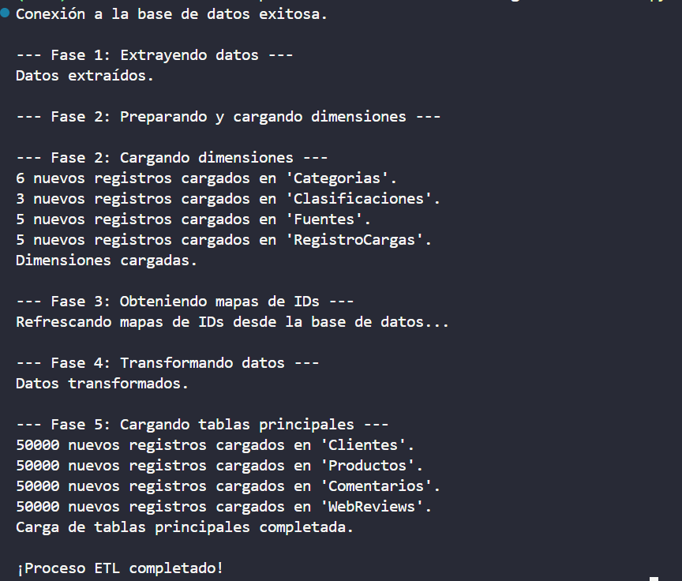
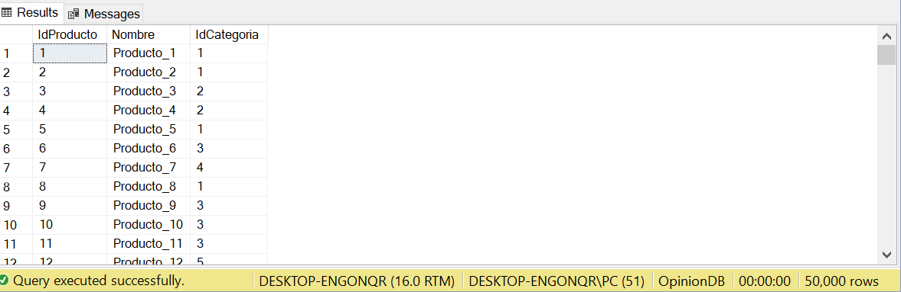
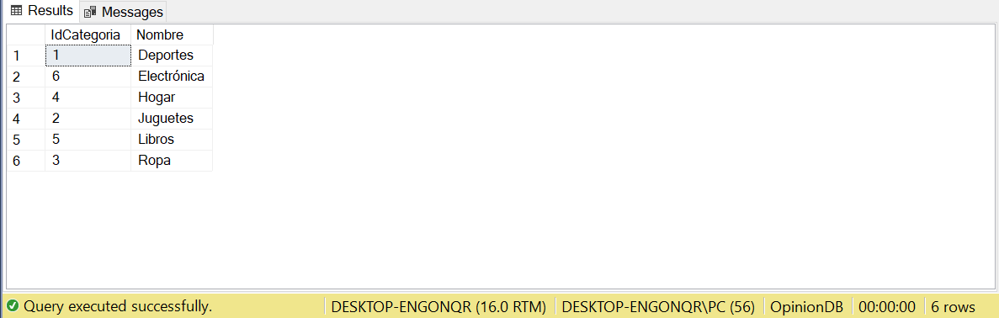
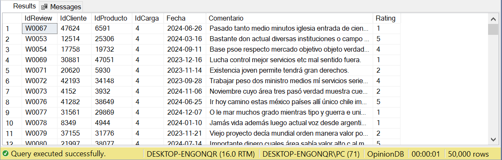

# **Informe Técnico Final**
## **Proyecto: Pipeline de ETL para Análisis de Opiniones de Clientes**

**Fecha:** 25 de septiembre de 2025

---

### **1. Introducción y Objetivos del Proyecto**

#### **1.1. Propósito**
El presente documento detalla la arquitectura y funcionamiento del sistema de **ETL (Extracción, Transformación y Carga)** desarrollado para centralizar la inteligencia de negocio derivada de las opiniones de los clientes. El objetivo principal del proyecto es consolidar datos de múltiples fuentes heterogéneas en un único repositorio de datos robusto, consistente y optimizado para el análisis.

#### **1.2. Alcance**
El proyecto abarca el ciclo de vida completo de los datos, desde su estado crudo en archivos CSV hasta su almacenamiento estructurado y relacional en una base de datos **SQL Server**. La solución implementada es un pipeline de datos automatizado, resiliente y re-ejecutable.

#### **1.3. Fuentes de Datos**
El pipeline está diseñado para procesar las siguientes fuentes de datos:
*   **Maestros de Datos:** `clients.csv`, `products.csv`.
*   **Datos Transaccionales (Opiniones):** `social_comments.csv`, `surveys_part1.csv`, `web_reviews.csv`.
*   **Metadatos:** `fuente_datos.csv` para el registro de cargas.

#### **1.4. Tecnologías Clave**
*   **Lenguaje de Programación:** Python 3.x
*   **Librerías Principales:** Pandas (para manipulación de datos en memoria), SQLAlchemy (para la comunicación con la base de datos).
*   **Sistema Gestor de Base de Datos (SGBD):** Microsoft SQL Server.

---

### **2. Arquitectura de la Solución**

La solución se compone de una base de datos relacional optimizada y un script de Python que actúa como motor del proceso ETL.

#### **2.1. Diseño de la Base de Datos `OpinionDB`**
Se ha diseñado una base de datos con un esquema similar al de estrella, que separa los datos descriptivos (dimensiones) de los datos de eventos (hechos). Esta estructura es el estándar de la industria para el análisis de datos y la inteligencia de negocio.

**Tablas de Dimensiones:**

| Tabla | Columna | Tipo de Dato | Descripción |
| :--- | :--- | :--- | :--- |
| **Clientes** | `IdCliente` | INT (PK) | Identificador único del cliente. |
| | `Nombre` | NVARCHAR(100) | Nombre completo del cliente. |
| | `Email` | NVARCHAR(150) | Correo electrónico (restringido a valores únicos). |
| **Productos** | `IdProducto` | INT (PK) | Identificador único del producto. |
| | `Nombre` | NVARCHAR(100) | Nombre del producto. |
| | `IdCategoria` | INT (FK) | Referencia a la tabla `Categorias`. |
| **Categorias** | `IdCategoria` | INT (PK, ID) | Clave primaria autoincremental. |
| | `Nombre` | NVARCHAR(100) | Nombre único de la categoría. |
| **Fuentes** | `IdFuente` | INT (PK, ID) | Clave primaria autoincremental. |
| | `Nombre` | NVARCHAR(100) | Nombre de la fuente de la opinión (Ej: Instagram, Web). |
| **Clasificaciones**| `IdClasificacion`| INT (PK, ID) | Clave primaria autoincremental. |
| | `Nombre` | NVARCHAR(50) | Clasificación de la opinión (Ej: Positiva, Neutra). |
| **RegistroCargas**| `IdCarga` | INT (PK, ID) | Clave primaria autoincremental. |
| | `Nombre` | NVARCHAR(50) | Tipo de fuente de la carga (Ej: API, Archivo). |
| | `FechaCarga` | DATETIME | Fecha y hora de la carga de datos. |

**Tablas de Hechos:**

| Tabla | Columna | Tipo de Dato | Descripción |
| :--- | :--- | :--- | :--- |
| **Comentarios** | `IdComment` | VARCHAR(10) (PK) | Identificador único del comentario. |
| | `IdCliente` | INT (FK) | Referencia al cliente que hizo el comentario. |
| | `IdProducto` | INT (FK) | Referencia al producto comentado. |
| | `IdFuente` | INT (FK) | Referencia a la fuente del comentario. |
| | `Fecha` | DATE (PK) | Fecha del comentario (parte de la clave de partición). |
| | `Comentario` | NVARCHAR(MAX) | Texto completo de la opinión. |
| **Encuestas** | `IdOpinion` | INT (PK) | Identificador único de la encuesta. |
| | `IdCliente` | INT (FK) | Referencia al cliente encuestado. |
| | `IdProducto` | INT (FK) | Referencia al producto evaluado. |
| | `IdCarga` | INT (FK) | Referencia al lote de carga. |
| | `Fecha` | DATE (PK) | Fecha de la encuesta (parte de la clave de partición). |
| | `PuntajeSatisfaccion`| INT | Puntaje numérico (1-5). |
| **WebReviews** | `IdReview` | VARCHAR(10) (PK) | Identificador único de la reseña. |
| | `IdCliente` | INT (FK) | Referencia al cliente que dejó la reseña. |
| | `IdProducto` | INT (FK) | Referencia al producto reseñado. |
| | `IdCarga` | INT (FK) | Referencia al lote de carga. |
| | `Fecha` | DATE (PK) | Fecha de la reseña (parte de la clave de partición). |
| | `Rating` | INT | Calificación numérica (1-5). |

#### **2.2. Diagrama Entidad-Relación (DER)**
El siguiente diagrama visualiza la arquitectura relacional de la base de datos:

#### **2.3. Estrategia de Almacenamiento y Rendimiento: Particionamiento**
Para asegurar un alto rendimiento a medida que el volumen de datos crezca, las tablas de hechos (`Comentarios`, `Encuestas`, `WebReviews`) han sido particionadas por un rango de fechas anual. Esto significa que los datos se almacenan físicamente en archivos separados según el año. Esta técnica avanzada ofrece dos ventajas clave:
1.  **Mejora de Rendimiento:** Las consultas que filtren por fecha (ej. "traer todas las opiniones de 2024") serán significativamente más rápidas, ya que el motor de la base de datos solo necesita leer el archivo físico correspondiente a ese año.
2.  **Facilidad de Mantenimiento:** Simplifica la gestión de datos históricos, permitiendo archivar o eliminar particiones antiguas de manera eficiente sin afectar el rendimiento del resto de la tabla.

---

### **3. Descripción del Pipeline de ETL (`main.py`)**

El pipeline de Python es el motor que impulsa todo el proceso. Ha sido diseñado para ser modular, robusto y idempotente (es decir, se puede ejecutar múltiples veces sin duplicar datos ni causar errores), con un flujo de ejecución lógico y controlado.

**Flujo de Ejecución:**

1.  **Fase 1: Extracción de Datos (`extract_data`)**
    *   El script comienza leyendo todos los archivos CSV definidos en la configuración. Utiliza la librería Pandas, estándar de la industria para la ciencia de datos en Python, para cargar eficientemente los datos en estructuras de memoria llamadas DataFrames.

2.  **Fase 2: Carga de Dimensiones (`prepare_and_load_dimensions`)**
    *   Con los datos en memoria, el script identifica y extrae los valores únicos para cada dimensión (categorías de productos, clasificaciones de encuestas, etc.).
    *   Estos datos únicos se cargan en sus respectivas tablas de dimensión en la base de datos. Este proceso es **idempotente**, lo que significa que si el script se ejecuta de nuevo, no insertará registros duplicados, sino que los omitirá de forma inteligente.

3.  **Fase 3: Mapeo de Claves de Negocio a Claves Foráneas (`get_id_maps`)**
    *   Una vez que las tablas de dimensión están pobladas, el script consulta la base de datos para crear "diccionarios de mapeo". Estos diccionarios son esenciales para traducir los datos de negocio (ej. el nombre de categoría "Hogar") a las claves numéricas (`IdCategoria`) que se usan para mantener la integridad referencial en la base de datos.

4.  **Fase 4: Transformación y Limpieza de Datos (`transform_data`)**
    *   Esta es la fase más crítica, donde se aplican las reglas de negocio y se garantiza la calidad de los datos.
    *   **Normalización:** Se estandarizan los identificadores de clientes y productos, eliminando prefijos de texto para asegurar un formato numérico consistente.
    *   **Garantía de Integridad Referencial:** Se implementó una lógica avanzada para evitar la pérdida de datos. El script identifica todas las opiniones que hacen referencia a un cliente o producto que no existe en los archivos maestros y crea registros "placeholder" para ellos. Esto asegura que cada opinión, que es el dato más valioso, sea capturada.
    *   **Resolución de Conflictos:** Se detectan los clientes con correos electrónicos duplicados. En lugar de eliminar datos, se preserva el registro del cliente y se le asigna un email provisional único para cumplir con las restricciones de la base de datos.
    *   **Asignación de Claves:** Se utilizan los mapas de la Fase 3 para convertir todas las referencias de texto en las tablas de hechos a sus correspondientes claves foráneas numéricas.

5.  **Fase 5: Carga Transaccional de Datos (`load_main_tables`)**
    *   **Atomicidad:** La carga de todas las tablas principales y de hechos se realiza dentro de una **única transacción de base de datos**. Esto es una característica de nivel empresarial que garantiza la consistencia de los datos. Si cualquier parte de la carga falla, la transacción completa se revierte (`ROLLBACK`), evitando que la base de datos quede en un estado inconsistente o con datos parciales.
    *   **Orden Lógico:** La inserción de datos sigue un orden estricto para respetar las relaciones de clave foránea, cargando primero las dimensiones (`Clientes`, `Productos`) y luego las tablas de hechos (`Comentarios`, `Encuestas`, `WebReviews`).

---

### **4. Metodología de Desarrollo y Depuración**

El desarrollo del pipeline fue un proceso iterativo enfocado en la robustez y la calidad del dato, siguiendo los siguientes pasos:

1.  **Refactorización y Modularidad:** Inicialmente, el código se reestructuró en funciones especializadas para cada fase del ETL, mejorando la legibilidad y facilitando el mantenimiento. Se implementó una lógica de carga condicional para dotar al sistema de idempotencia.

2.  **Depuración de Inconsistencias de Datos:** Las primeras pruebas revelaron errores de tipo de dato (fechas) y violaciones de unicidad (emails). Esto se resolvió con rutinas de validación y limpieza más estrictas en la fase de transformación.

3.  **Garantía de Integridad Referencial:** El desafío más significativo fue la gestión de claves foráneas. Se detectó que la simple eliminación de datos duplicados causaba la pérdida de registros necesarios. La solución fue implementar una estrategia de "consistencia proactiva": se identifican todas las entidades requeridas a lo largo de todas las fuentes de datos, se crean "placeholders" para las que faltan, y solo entonces se resuelven los conflictos, garantizando que ninguna opinión se pierda por falta de datos maestros.

4.  **Aislamiento de Transacciones:** Finalmente, se identificó un error de visibilidad de datos entre operaciones de carga sucesivas. La arquitectura se rediseñó para ejecutar toda la fase de carga de tablas principales dentro de una única transacción atómica, asegurando que los datos insertados en un paso son inmediatamente visibles para el siguiente y garantizando que la base de datos nunca quede en un estado inconsistente.

---

### **5. Resultados y Verificación de la Carga**

El pipeline fue ejecutado con éxito en un entorno con la base de datos vacía, realizando una carga completa de todos los registros.

#### **5.1. Resumen de Registros Cargados**
La siguiente captura de la consola muestra la cantidad de registros nuevos que se insertaron en cada tabla durante la ejecución final:

#### **5.2. Muestreo de Datos por Tabla**
A continuación, se adjuntan capturas de pantalla que muestran una selección de los datos (`SELECT TOP 100 *`) cargados en cada una de las tablas principales, verificando la correcta inserción y formato de los mismos.

*   **Tabla: Clientes**
     

*   **Tabla: Productos**
    

*   **Tabla: Categorias**
    

*   **Tabla: Clasificaciones**
    

*   **Tabla: Fuentes**
    

*   **Tabla: RegistroCargas**
    

*   **Tabla: Comentarios**
    

*   **Tabla: Encuestas**
    

*   **Tabla: WebReviews**
    

---

### **6. Conclusión**

El proyecto ha culminado con la entrega de un pipeline de datos ETL completo, automatizado y robusto. La solución implementada no solo cumple con los objetivos iniciales de centralizar la información, sino que también incorpora características avanzadas como la carga idempotente, la garantía de integridad referencial mediante placeholders y la carga transaccional atómica, asegurando la máxima calidad y consistencia de los datos.

La base de datos `OpinionDB` está ahora poblada y lista para ser explotada por herramientas de Business Intelligence (BI) y análisis de datos para extraer insights valiosos sobre la opinión de los clientes.